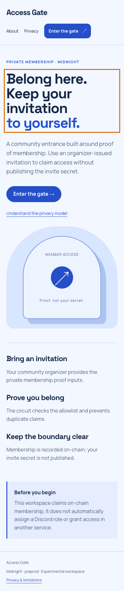
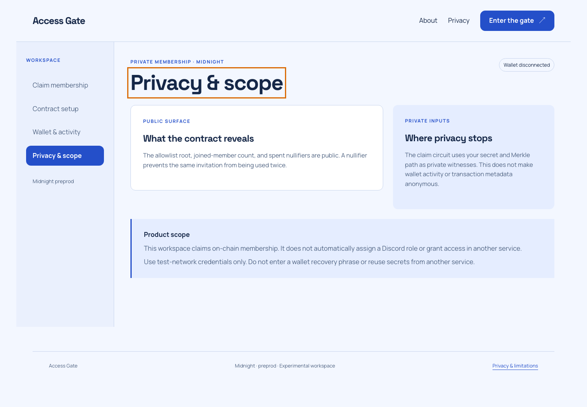
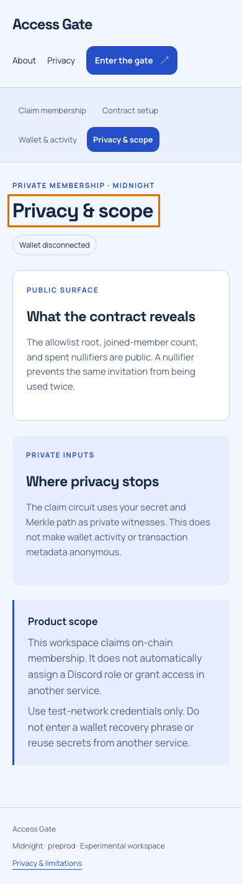
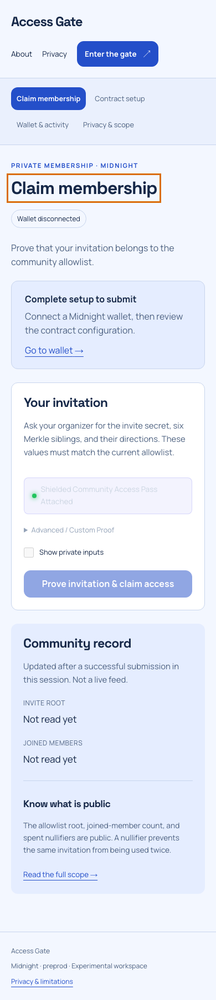
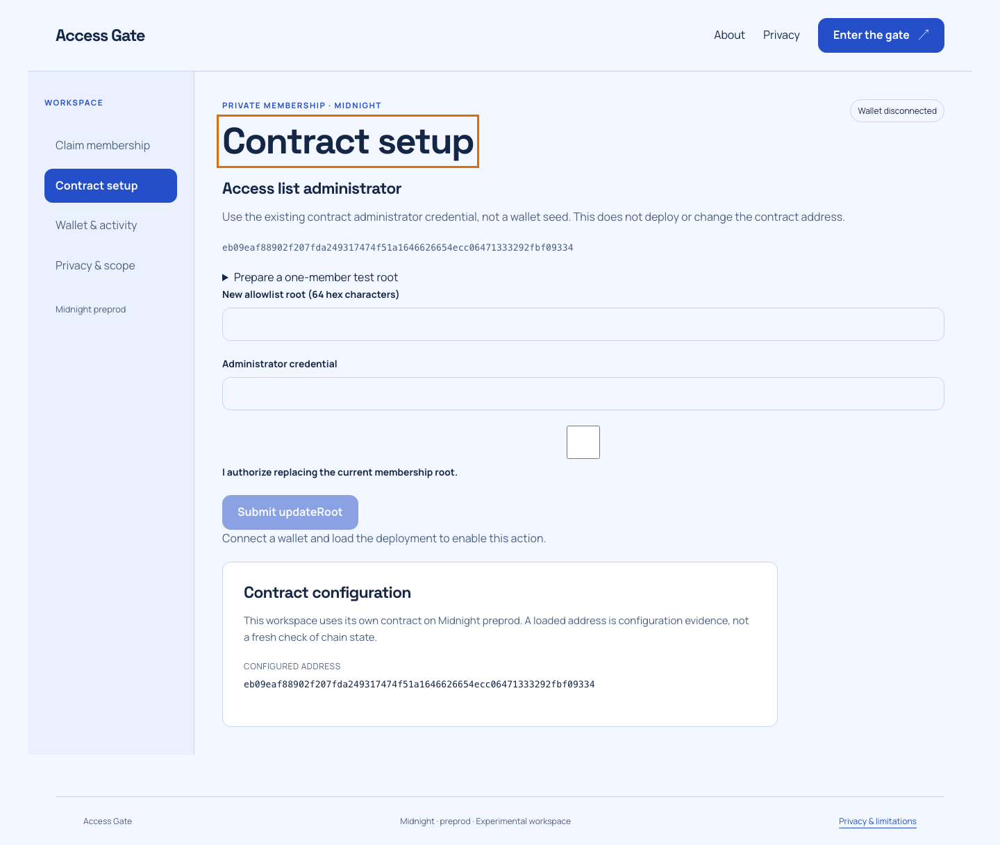
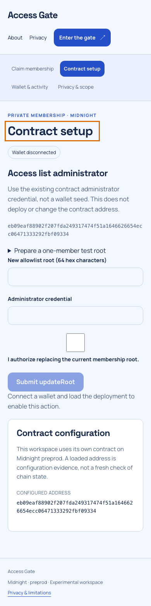
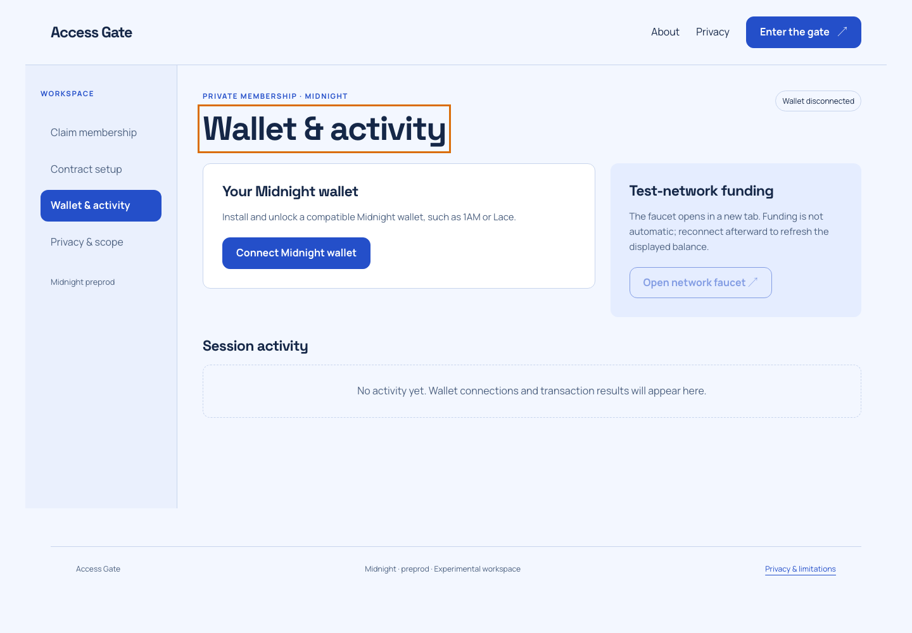
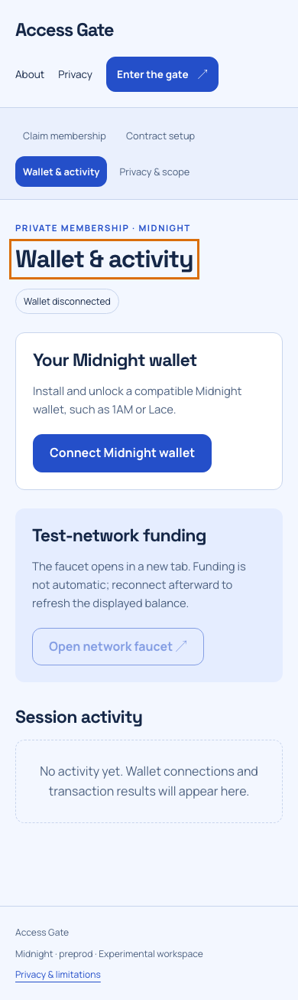

# Community Checkpoint: Shielded Guild Entry Gate 🛡️


## Desktop and mobile walkthrough

Fresh captures of this build at 1440 × 1000 and 390 × 844. Wallet disconnected; no credentials entered. These images document the interface, not transaction finality.

<details>
<summary>View every page at both screen sizes</summary>

| Page | Desktop | Mobile |
| --- | --- | --- |
| home |  |  |
| privacy |  |  |
| dashboard |  |  |
| deployer |  |  |
| walletHub |  |  |

</details>

Capture details: [manifest](screenshots/capture-manifest.json). Recorded walkthrough: [demo video](demo.webm).
### Rise In — Midnight Journey to Mastery (Level 4 Capstone Submission)

[](https://midnight.network)
[](https://docs.midnight.network)
[](https://risein.com)
[]()
[](https://github.com/Shrikantshirshe/private-community-server-entry/actions/workflows/frontend-ci.yml)
[](https://github.com/Shrikantshirshe/private-community-server-entry/actions/workflows/contract-ci.yml)

**Community Checkpoint** is a confidential, zero-knowledge community gating portal built on the **Midnight Network**. Discord servers, Telegram communities, and web3 DAOs can verify that new members belong to authorized contributor cohorts or hold access rights via depth-3 Merkle trees without collecting member wallet addresses, tracking social accounts, or exposing membership rosters.

---

## 🎬 Product Demo Video

- 🌐 **Watch Online:** [Stream on Google Drive ↗](https://drive.google.com/file/d/109VfDLFmNeRN2wsmMAMUcuNLfkA4Inv4/view?usp=sharing)
- 📁 **Local Video File:** [`demo.webm`](./demo.webm)

<video src="./demo.webm" controls="controls" width="100%"></video>

---

## 📋 Rise In Level 4 Capstone Submission Evidence

| Requirement | Evidence / Implementation Details |
| :--- | :--- |
| **Public Source Repository** | [Shrikantshirshe/private-community-server-entry](https://github.com/Shrikantshirshe/private-community-server-entry) |
| **Commit Volume** | 25+ structured commits detailing checkpoint circuits and entrance UI |
| **Compact Smart Contract** | `contracts/server_allowlist.compact` compiled with Compact 0.30.0 |
| **Automated Verification** | Full test suite in `src/test/server_allowlist.test.ts` testing Merkle roots and entry passes |
| **Web DApp Frontend** | Cyberpunk-themed entrance terminal built with React, TypeScript, and Vite |
| **Instant Visitor Access** | Midnight Lace wallet integration with automated visitor pass derivation |
| **Preprod Deployment** | Verified on Midnight Preprod (`eb09eaf88902...9334`) |
| **Demo Walkthrough** | Video demonstrating root publication, ZK pass generation, and server entry claim |
| **Documentation Dossier** | Complete [PROPOSAL.md](PROPOSAL.md), [TESTING.md](TESTING.md), [SECURITY.md](SECURITY.md), and [OPERATIONS.md](OPERATIONS.md) |

---

## 🌟 Executive Summary & Problem Solved

### The Problem
Traditional token-gating bots (like Collab.Land or Guild.xyz) pose severe security and privacy vulnerabilities:
1. **Centralized Bot Exploits:** Centralized Discord bots get compromised frequently, draining connected user wallets.
2. **Social-Wallet Doxxing:** Linking a Discord handle to an on-chain Ethereum or Solana address permanently doxxes a user's net worth and holdings.
3. **Sybil & Replay Vulnerabilities:** Replay attacks allow multiple Discord accounts to enter a server using a single borrowed wallet.

### The Midnight Solution
Community Checkpoint utilizes **Off-Chain Merkle Memberships + Single-Use Nullifiers**:
- The guild admin publishes only the top-level Merkle Root of verified community members.
- Members prove inclusion in the root via zero-knowledge proof; the bot never sees their wallet address.
- A cryptographic nullifier is consumed, guaranteeing each authorized spot is used exactly once.

---

## 🔒 Zero-Knowledge Architecture & Privacy Model

```
       [Community Member]
               │
  (Secret Key + Depth-3 Merkle Path)
               │
               ▼
      [Compact ZK Prover]
               │
   Proves: Member is in Server Roster
   Derives Nullifier = hash(SK, ServerID)
               │
               ▼
   [Midnight Preprod Blockchain]
               │
   1. Validates Merkle Inclusion Proof
   2. Marks Nullifier as Claimed
   3. Increments Verified Member Count
```

- **Private Witness:** Member secret key (`sk`), private leaf value, and Merkle tree siblings.
- **Public Ledger State:** Community Merkle root, verified members counter, and consumed nullifiers.
- **Circuit Guarantee:** An attacker cannot reuse another member's proof, and an admin cannot identify which member claimed access.

---

## 📜 Smart Contract Surface (`contracts/server_allowlist.compact`)

Key exported circuits:
- `updateRoot(new_root)`: Administrator rotates the server authorization Merkle root.
- `claimEntry()`: Enforces Merkle inclusion, updates verified member counts, and records nullifiers.
- `computeRootDepth3(leaf, proof, directions)`: Depth-3 cryptographic Merkle tree verification.
- `computeNullifier(sk)`: Derives deterministic anti-replay nullifier.

---

## 🚀 On-Chain Deployment Coordinates

| Field | Preprod Verification Record |
| :--- | :--- |
| **Network** | Midnight Preprod |
| **Contract Name** | `server_allowlist` |
| **Contract Address** | `eb09eaf88902f207fda249317474f51a1646626654ecc06471333292fbf09334` |
| **Deployment Transaction** | `8d2fff29a7fe14c3ec4611f6d78a0d1e52222af8bb605be925b3bc6a545913d3` |
| **Confirmation Status** | Confirmed by Midnight Preprod Indexer |

---

## 💻 Local Setup & Reproduction Guide

### Prerequisites
- Node.js 20.x or 22.x
- npm 10.x
- Compact compiler 0.30.0

```bash
# Install dependencies
npm install

# Compile zero-knowledge circuits
npm run compile

# Run tests
npm test

# Build production bundle
npm run build

# Launch development server
npm run dev
```

---

## 📁 Repository Structure

- `contracts/server_allowlist.compact`: Compact ZK contract governing guild memberships and nullifiers.
- `src/App.tsx`: Cyberpunk community portal, Merkle verification, and server gateway.
- `src/midnightClient.ts`: Midnight Lace wallet integration and proof submission.
- `src/test/server_allowlist.test.ts`: Automated tests covering Merkle paths, invalid roots, and double-entry rejections.
- `PROPOSAL.md`, `TESTING.md`, `SECURITY.md`, `OPERATIONS.md`: Comprehensive engineering runbooks.
